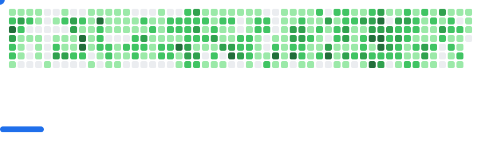

## Hi there, I'm Alessandro 👋

Tech Lead & Senior .NET Developer at ALEBRO Technologies.  
I build reliable software, modernize old systems, and automate everything I can.  
If it runs on .NET, I’ve probably shipped it — web, desktop, mobile, APIs, CI/CD, you name it.

### What I Do
- Lead development teams and define technical direction  
- Build .NET apps across web, desktop, mobile, and backend  
- Modernize legacy systems (Framework → .NET 7/8/9/10 migrations)  
- Automate releases with GitHub Actions and internal tooling  
- Design APIs and end‑to‑end workflows
  
### About me
- 📫 How to reach me: Just message me on [BlueSky](ilgianfri.bsky.social) or on Telegram
- 😄 Pronouns: he/him/his
- 💬 Languages: Italian & English
- 📱 [I love prototypes](https://protobetatest.com/) and anything that has a chip in it
- 🔭 I was working on [Fenice for Twitter](https://twitter.com/FeniceWindows) in my free time with @gus33000. Not anymore. [RIP 🕊️](https://twitter.com/FeniceWindows/status/1616198212645167105)
- ⚡ Fun fact: When I was 14 I've released one of the first apps for Windows 8 with [@ilFabrz](https://github.com/ilfabrz) - [Interview](https://www.punto-informatico.it/il-sogno-di-microsoft-per-i-giovani/)

### Info
- 🎓 All repos starting with UPO are projects I've created for university exams

<picture>
  <source
    media="(prefers-color-scheme: dark)"
    srcset="images/breakout-dark.svg"
  />
  <source
    media="(prefers-color-scheme: light)"
    srcset="images/breakout-light.svg"
  />
  
</picture>

### Find me on: 
- [Twitter](https://twitter.com/ilGianfri)
- [BlueSky](https://ilgianfri.bsky.social)
- [Mastodon](https://mastodon.social/@ilgianfri)
- [Linkedin](https://www.linkedin.com/in/alessandrospisso/)

## Stats

<!-- why are you checking the source of my readme, go away -->
